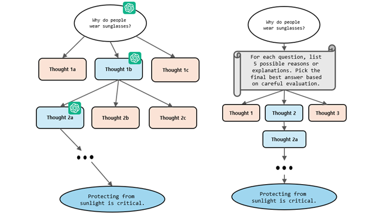
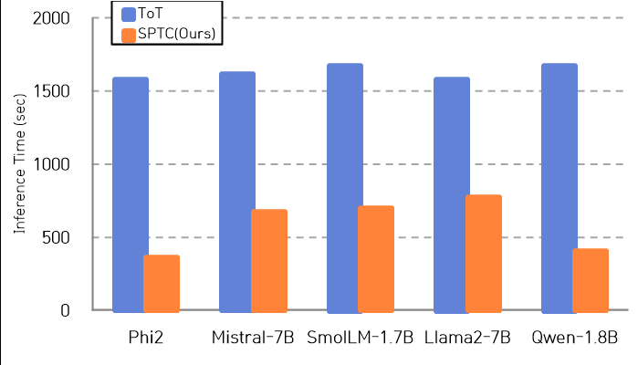

# SPTC (Single Pass Tree Chain-of-Thought) : Efficient prompting scheme for Small Language Models

SPTC는 반복적인 외부 호출 없이 단일 프롬프트 내에서 여러 추론 후보를 생성·평가해 최적 답변을 선택하는 새로운 구조적 추론 기법
경량화된 소형 언어 모델(SLM) 환경에서도 높은 정확도와 빠른 추론 속도 달성

## 소개
KCC2025

기존 Chain-of-Thought (CoT) 방식은 단일 추론 경로만 탐색하여 한계 존재

Tree-of-Thought (ToT)는 여러 사고 경로를 탐색하지만, 외부 대형 모델을 반복 호출하여 많은 시간과 비용 필요

SPTC는 첫 단계에서 여러 답변 후보를 단일 프롬프트 내에서 생성·평가하여 최적 답변을 선정하고, 이후 CoT 방식으로 추론을 이어감감

이를 통해 ToT 대비 추론 시간이 약 1.5배 빠르면서도 비슷한 수준의 정확도 유지 가능

## 특징
단일 프롬프트 내에서 사고 생성, 평가, 선택 수행

외부 LLM 호출 없이 SLM 자체 평가만으로 추론

추론 속도 향상 및 비용 절감

일관된 평가 기준으로 높은 정확도 보장

여러 SLM 모델(Mistral-7B, Phi-2, LLaMA 2, Qwen 등등)에서 검증 완료

## 결과

## Research Paper
For more details, please refer to the full paper:

Title: SPTC(Single Pass Tree Chain-of-thought) : Efficient prompting scheme for Small Language Models
Authors: Kabeen Kim, Jiye Park
Conference: Korean Computer Congress (KCC 2025)
Link: Download Paper
